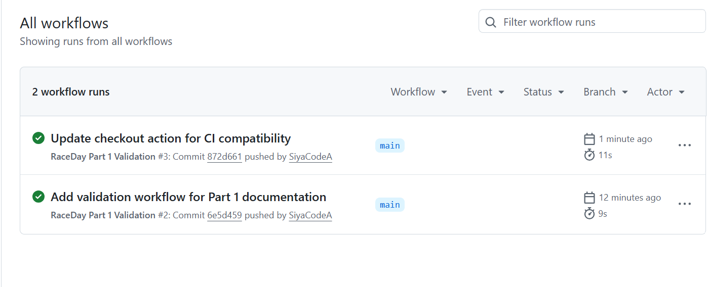

# RaceDay

## Project Overview

RaceDay is a web-based race event management system designed for the South African road running, walking and cycling community.

The system supports two main user roles: **Organisers** and **Participants**. Organisers can create and manage race events, categories and participant results, while Participants can browse available events, enter races, view their entries and track their results.

Part One of the project focuses on the planning and database foundation of the RaceDay system. This includes the Entity Relationship Diagram (ERD), API endpoint plan and SQL database script. These artefacts provide the design foundation for the REST API and MVC application that will be developed in later parts of the project.

---

## Features

### Organiser Features

* Create race events
* Update race events
* Delete race events
* Manage event categories
* View entries for their events
* Capture and manage participant results

### Participant Features

* Create and manage an account
* Browse available race events
* View event information
* Enter race events
* View personal entries
* View personal race results and performance history

### Part One Features

* Logical database design
* Entity Relationship Diagram
* REST API endpoint planning
* SQL Server database schema
* Seed/sample data
* Database constraints and relationships
* GitHub version control
* GitHub Actions CI validation

---

## Technology Stack

| Technology                          | Purpose                                           |
| ----------------------------------- | ------------------------------------------------- |
| C#                                  | Application development                           |
| .NET / ASP.NET Core                 | Backend and REST API development                  |
| SQL Server                          | Relational database                               |
| SQL Server Management Studio (SSMS) | Database development and testing                  |
| REST API                            | Communication between application components      |
| GitHub                              | Source control and project repository             |
| GitHub Actions                      | Continuous integration and automated validation   |
| MVC                                 | Web application architecture in Part Three        |
| Docker                              | Application containerisation in later development |
| Microsoft Azure                     | Cloud services in later development               |

---

## Repository Structure

```text
RaceDay/
│
├── .github/
│   └── workflows/
│       └── part1-validation.yml
│
├── docs/
│   │
│   ├── API/
│   │   ├── API_Endpoint_Plan.xlsx
│   │   └── API_Endpoint_Plan.pdf
│   │
│   ├── CI/
│   │   └── Part1-CI-Success.png
│   │
│   ├── ERD/
│   │   └── RaceDay-ERD.png
│   │
│   └── SQL/
│       └── RaceDayDatabase.sql
│
└── README.md
```

The `docs` directory contains the main Part One planning, database and CI evidence artefacts.

The Excel API plan is retained as the editable working version, while the PDF version is provided as the formal documentation artefact.

---

## Part One Documentation

### ERD

The Entity Relationship Diagram is available at:

[**RaceDay ERD**](docs/ERD/RaceDay-ERD.png)

The ERD represents the RaceDay database entities, attributes, primary keys, foreign keys, relationships and cardinalities.

### API Endpoint Plan

The completed API endpoint plan is available in PDF format:

[**API Endpoint Plan – PDF**](docs/API/API_Endpoint_Plan.pdf)

An editable Excel version is also included:

[**API Endpoint Plan – Excel**](docs/API/API_Endpoint_Plan.xlsx)

The plan defines the REST API endpoints required by the system, including HTTP methods, routes, descriptions, required roles, parameters, request bodies, expected responses and failure responses.

The planned API areas include:

* Authentication
* Accounts
* Events
* Categories
* Entries
* Results
* Routes
* Weather

### SQL Database Script

The database script is available at:

[**RaceDay Database SQL Script**](docs/SQL/RaceDayDatabase.sql)

The script contains the SQL required to create the RaceDay database structure, define its constraints and relationships, and populate it with sample data.

---

## Reproducing the Part One Setup

Another developer should be able to reproduce the Part One database and review the planning artefacts using the files contained in this repository.

### Requirements

Before starting, install or have access to:

* Git
* GitHub account
* SQL Server
* SQL Server Management Studio (SSMS)

### Step 1 – Clone the Repository

Clone the repository from GitHub:

```bash
git clone https://github.com/SiyaCodeA/RaceDay-System.git
```

Navigate into the project directory:

```bash
cd RaceDay
```

### Step 2 – Verify the Repository Contents

Confirm that the following Part One artefacts are present:

```text
docs/
├── API/
│   ├── API_Endpoint_Plan.xlsx
│   └── API_Endpoint_Plan.pdf
├── CI/
│   └── Part1-CI-Success.png
├── ERD/
│   └── RaceDay-ERD.png
└── SQL/
    └── RaceDayDatabase.sql
```

The GitHub Actions workflow should also be present at:

```text
.github/
└── workflows/
    └── part1-validation.yml
```

### Step 3 – Review the ERD

Open:

```text
docs/ERD/RaceDay-ERD.png
```

Use the ERD to understand the database entities, attributes and relationships before executing the SQL script.

### Step 4 – Set Up the Database

Open **SQL Server Management Studio**.

1. Connect to the required SQL Server instance.
2. Open:

```text
docs/SQL/RaceDayDatabase.sql
```

3. Review the script.
4. Execute the complete script.
5. Confirm that the RaceDay database and required tables have been created.
6. Confirm that the supplied seed/sample data has been inserted successfully.

### Step 5 – Verify the Database

After execution, verify that:

* All expected tables exist.
* Primary keys have been created.
* Foreign key relationships have been created.
* Required constraints are present.
* Seed data has been inserted.
* The resulting database structure corresponds with the final ERD.

### Step 6 – Review the API Plan

Open the formal PDF:

```text
docs/API/API_Endpoint_Plan.pdf
```

The Excel version is available for reference or further editing:

```text
docs/API/API_Endpoint_Plan.xlsx
```

Review the planned endpoints and confirm that they correspond with the system requirements and database design.

This completes the reproducible **Part One setup**.

---

## SQL Instructions

The SQL script is designed to be executed on a clean SQL Server instance or test database environment.

The recommended process is:

1. Open SQL Server Management Studio.
2. Connect to SQL Server.
3. Open `docs/SQL/RaceDayDatabase.sql`.
4. Execute the complete script.
5. Check for execution errors.
6. Refresh the database list and verify that the RaceDay database has been created.
7. Inspect the tables and relationships.
8. Query the tables to confirm that the seed data has been inserted.

The SQL implementation should remain consistent with the final ERD.

---

## CI/CD Evidence

GitHub Actions is used to validate the required Part One documentation files.

The validation workflow checks that the required ERD, API Endpoint Plan, SQL database script and README files are present in the repository.

### Successful CI Validation



The successful workflow execution provides evidence that the Part One repository validation completed successfully.

---

## Future Development

The RaceDay project will continue beyond Part One.

### Part Two – REST API

The planned REST API will be implemented using ASP.NET Core and will provide functionality for:

* Authentication
* Accounts and profiles
* Events
* Categories
* Entries
* Results
* Routes
* Weather information

Role-based access control will be implemented at the API level.

### Part Three – MVC Application

The MVC web application will provide the user-facing interface for Organisers and Participants.

Further planned development includes:

* MVC implementation
* Role-based functionality
* Azure Blob Storage
* Docker/containerisation
* Cloud deployment
* Integration between the MVC application, REST API and database

---

## Presentation

The Part One presentation video will demonstrate:

* The RaceDay system planning
* ERD design decisions
* API endpoint plan choices
* SQL database design
* Execution of the SQL script in SQL Server Management Studio
* Part One project structure and validation

**YouTube Link:**
*To be added once the presentation has been uploaded.*
